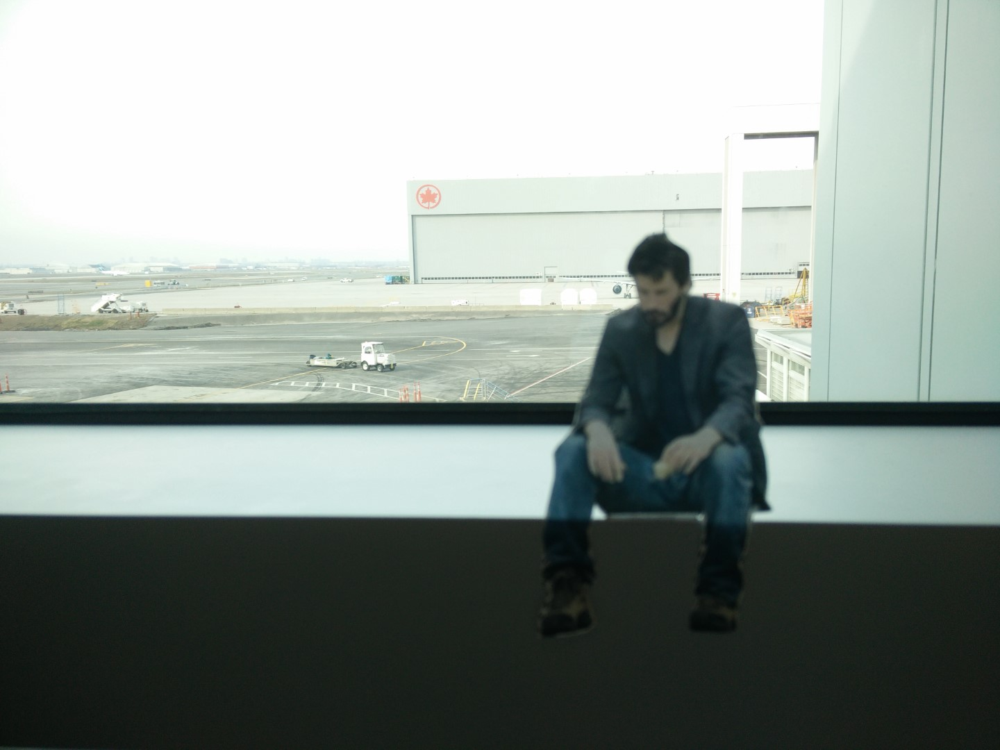
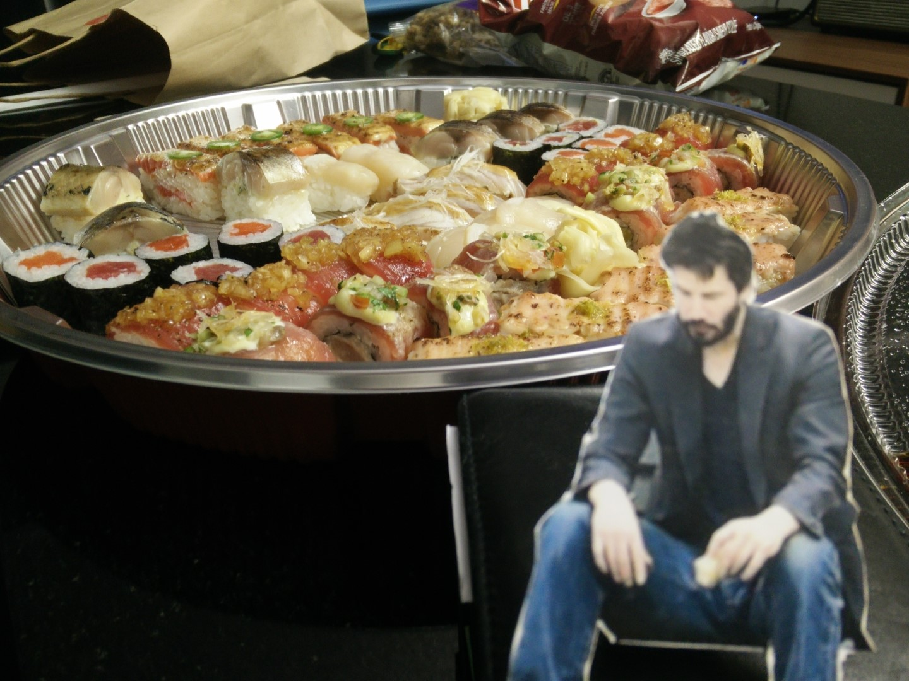

  Ah, yes, the Flat Keanu project. An offshoot of the <a href="https://en.wikipedia.org/wiki/Flat_Stanley">Flat Stanley project</a>.
  
  In a nutshell, it's a reference to a children's book about a character named Stanley and how he was tragically flattened. Stanley used this to his advantage

  by doing things that only flat people could do, and one of the things he did was mail himself to other places in an envelope, which many children have done IRL.

  It's very wholesome :) I decided to do something similar (but more for entertainment) and bring along *Flat Keanu* with me on my travels, a cut-out of Keanu Reeves 

  on a bench eating a sandwich alone, also dubbed <a href="https://knowyourmeme.com/memes/sad-keanu">*Sad Keanu*</a>

  Check back later, this page is updated semi-frequently! 


  
  
  
 